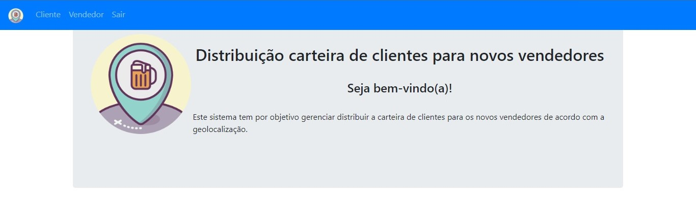
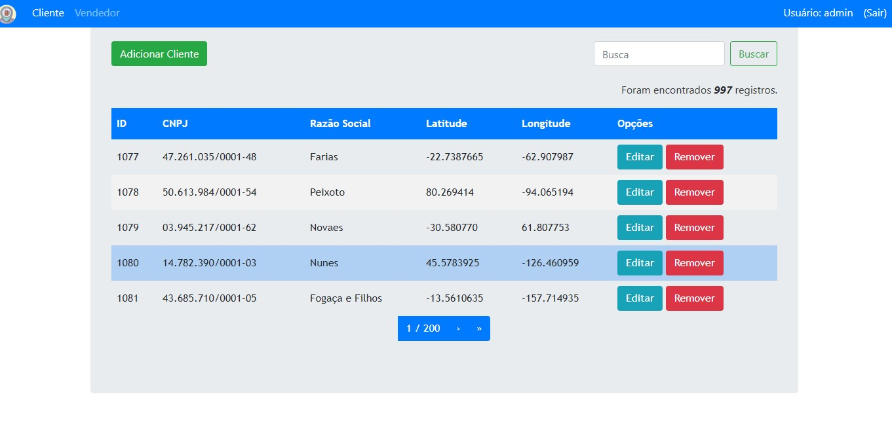
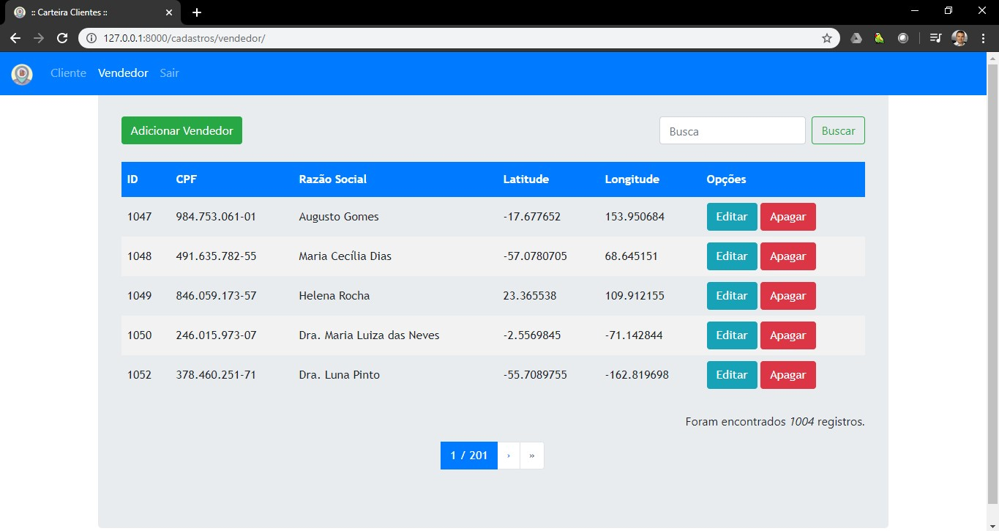
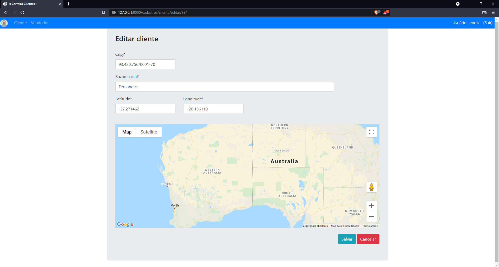

Distribuição carteira de clientes para novos vendedores
=======================================================

<div align="center">
  
</div>

### Este sistema tem por objetivo gerenciar e distribuir a carteira de clientes para os novos vendedores de acordo com a geolocalização.

* * *

Ambientação
-----------

#### Criar ambiente virtual

```
python -m virtualenv venv
```

#### Ativar ambiente virtual (Windows)

``` 
./venv/Scripts/activate
```

#### Instalar requerimentos

``` 
pip install -r requirements.txt
```

Execução
--------

#### Executar migrate

``` 
python manage.py migrate 
```

#### Criar super user

``` 
python manage.py createsuperuser 
```

#### Alimentar base de dados
```
python populate.py
```

#### Rodar servidor


```
python manage.py runserver
```

Popular base de dados
```
python populate.py
```


Acesso
-----------

Usuário
```
http://127.0.0.1:8000
```

Administrador
```
http://127.0.0.1:8000/admin
```

* * *

Visão Geral
-----------

### Tela Login

  

### Tela Bem-vindo(a)

  

### Tela Clientes

  

### Tela Vendedores

  

### Tela Edição


